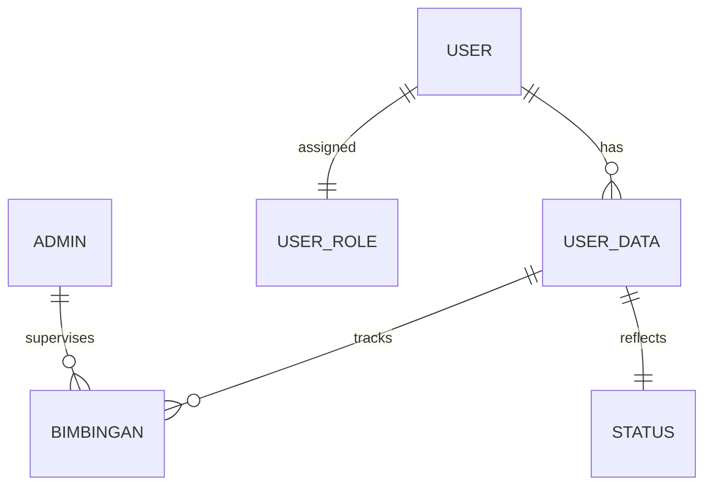

# 🎓 scholarAyy - Enterprise Academic Guidance Management System

[](https://codeigniter.com/)
[](https://www.php.net/)
[](https://www.mysql.com/)
[](https://getbootstrap.com/)

**scholarAyy** adalah solusi sistem informasi manajemen akademik yang komprehensif, dirancang untuk mengelola alur bimbingan proyek/tugas akhir secara profesional. Sistem ini memastikan kolaborasi yang efisien antara mahasiswa dan institusi pendidikan melalui digitalisasi dokumen dan pemantauan progres yang real-time.

---

## 🚀 Fitur Utama Berdasarkan Peran (RBAC)

Sistem ini menerapkan **Role-Based Access Control (RBAC)** untuk menjaga integritas data dan alur kerja:

| Fitur | 👨‍🎓 Mahasiswa | 👨‍🏫 Dosen | 🛠️ Koordinator |
| :--- | :---: | :---: | :---: |
| **Dashboard Progres** | ✅ | ✅ | ✅ |
| **Manajemen Dokumen (Proposal/Laporan)** | ✅ (Upload) | ✅ (Review) | ✅ (Kontrol) |
| **Presensi & Log Bimbingan** | ✅ | ✅ (Verifikasi) | ✅ (Monitoring) |
| **Tanda Tangan Digital** | ❌ | ✅ | ❌ |
| **Pembagian Pembimbing** | ❌ | ❌ | ✅ |
| **Manajemen Akun User** | ❌ | ❌ | ✅ |
| **Template & Buku Pedoman** | ✅ | ✅ | ✅ |

---

## 🏗️ Arsitektur Teknis

### 1. Backend & Logic
- **Framework CI3**: Menggunakan pola desain **Model-View-Controller (MVC)** untuk pemisahan logika bisnis yang bersih dan skalabilitas tinggi.
- **Security**: Implementasi password hashing menggunakan algoritma **Bcrypt** dan manajemen sesi yang aman.
- **Validasi Data**: Menggunakan CI Form Validation untuk memastikan integritas input pengguna.

### 2. Frontend & User Experience
- **Responsive Dashboard**: Dibangun di atas template dashboard profesional berbasis **Bootstrap 4**.
- **Data Management**: Integrasi **jQuery DataTables** untuk pengolahan tabel yang dinamis dan pencarian instan.
- **Iconography**: Menggunakan **FontAwesome 5** untuk antarmuka yang modern dan intuitif.

### 3. Database Schema (ERD Overview)
Sistem ini mengelola data yang kompleks melalui hubungan relasional antar tabel:



---

## 📂 Struktur Proyek (MVC Overview)

```text
scholarAyy/
├── application/
│   ├── controllers/    # Alur logika sistem (Auth, Mahasiswa, Dosen, Koordinator)
│   ├── models/         # Interaksi data ke Database
│   ├── views/          # Antarmuka pengguna (Frontend)
│   └── config/         # Konfigurasi sistem & database
├── assets/
│   ├── css/            # Custom styling
│   ├── js/             # Interactive scripts
│   └── vendor/         # Third-party libraries (Bootstrap, DataTables)
└── database/
    └── db_bimbingan.sql # Skema database lengkap
```

---

## 🔧 Panduan Instalasi Lokal

### Prasyarat
- Web Server (Rekomendasi: XAMPP dengan PHP 7.4).
- Database Server (MySQL/MariaDB).

### Langkah-langkah
1. **Ekstrak & Pindahkan**: Masukkan folder `bimbingan` ke dalam direktori `C:/xampp/htdocs/`.
2. **Setup Database**:
   - Buka `localhost/phpmyadmin`.
   - Buat database baru bernama `db_bimbingan`.
   - Import file `database/db_bimbingan.sql`.
3. **Konfigurasi Database**: Edit file `application/config/database.php`:
   ```php
   'hostname' => 'localhost',
   'username' => 'root',
   'password' => '',
   'database' => 'db_bimbingan',
   ```
4. **Konfigurasi Base URL**: Edit file `application/config/config.php`:
   ```php
   $config['base_url'] = 'http://localhost/bimbingan/';
   ```
5. **Selesai**: Akses sistem di browser melalui alamat `http://localhost/bimbingan/`.

---

## 🛡️ Lisensi & Kontributor
Proyek ini dikembangkan untuk meningkatkan kualitas sirkulasi akademik di lingkungan pendidikan tinggi.

*Developed with focus on Academic Excellence.*
